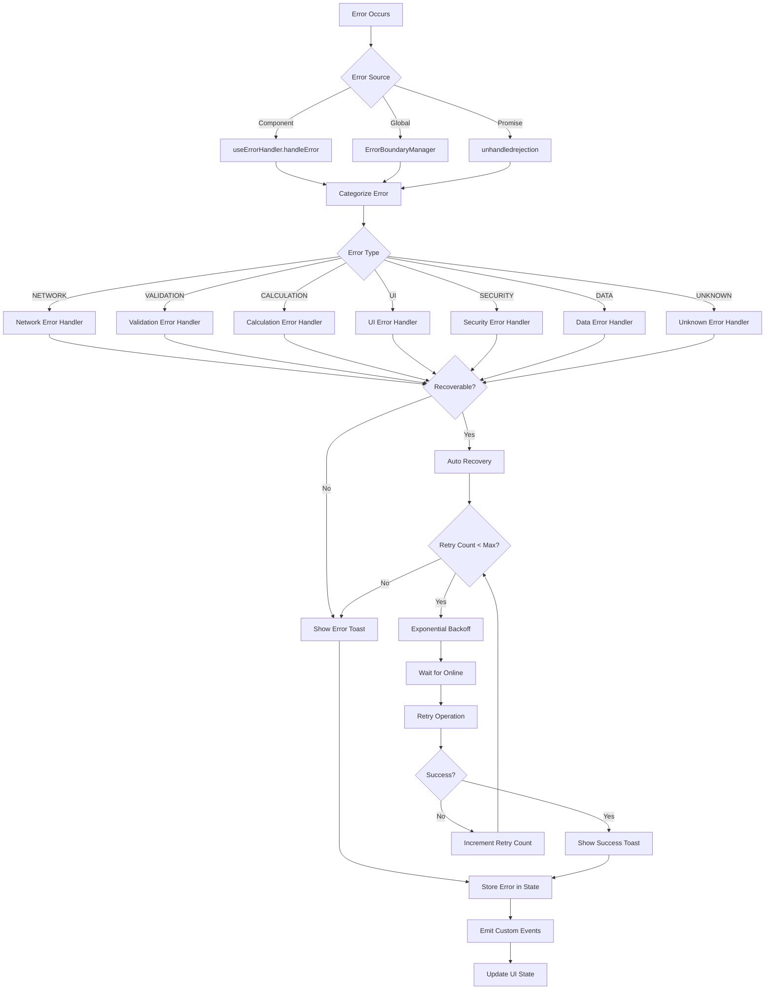

# Error Handler Architecture Diagram

## Overview

The `useErrorHandler` composable provides a comprehensive error handling system for the medical calculator application, integrating with Vue 3's composition API and PrimeVue's toast system for user notifications.

## Architecture Diagram

```
┌─────────────────────────────────────────────────────────────────────────────┐
│                           Vue 3 Medical Calculator                           │
│                                                                             │
│  ┌─────────────────────────────────────────────────────────────────────┐   │
│  │                      useErrorHandler Composable                      │   │
│  │                                                                     │   │
│  │  ┌──────────────────┐     ┌─────────────────┐     ┌──────────────┐ │   │
│  │  │   Configuration  │     │   State         │     │   Methods    │ │   │
│  │  │                  │     │                 │     │              │ │   │
│  │  │ • showToasts     │     │ • errors[]      │     │ • handleError│ │   │
│  │  │ • autoRetry      │     │ • isOnline      │     │ • clearErrors│ │   │
│  │  │ • maxRetries     │     │ • retryAttempts │     │ • showSuccess│ │   │
│  │  │ • retryDelay     │     │ • computed:     │     │ • showInfo   │ │   │
│  │  │ • onError        │     │   - hasErrors   │     │ • showWarning│ │   │
│  │  │ • onRecovery     │     │   - networkErr  │     │ • categorize │ │   │
│  │  └──────────────────┘     │   - validationE │     │ • isRecover  │ │   │
│  │                           │   - calculationE│     └──────────────┘ │   │
│  │                           └─────────────────┘                      │   │
│  └─────────────────────────────────────────────────────────────────────┘   │
│                                       │                                     │
│                                       │                                     │
│  ┌─────────────────────────────────────▼─────────────────────────────────┐   │
│  │                     Error Boundary Manager                           │   │
│  │                                                                     │   │
│  │  ┌─────────────────┐  ┌─────────────────┐  ┌─────────────────────┐ │   │
│  │  │  Error Types    │  │  Error Classes  │  │  Error Processing   │ │   │
│  │  │                 │  │                 │  │                     │ │   │
│  │  │ • NETWORK       │  │ • MedicalCalc   │  │ • categorizeError   │ │   │
│  │  │ • CALCULATION   │  │ • NetworkError  │  │ • getUserFriendly   │ │   │
│  │  │ • VALIDATION    │  │ • CalculationE  │  │ • isRecoverable     │ │   │
│  │  │ • UI            │  │ • ValidationE   │  │ • handleError       │ │   │
│  │  │ • SECURITY      │  │ • UIError       │  │ • autoRecovery      │ │   │
│  │  │ • DATA          │  │ • SecurityError │  │ • eventDispatch     │ │   │
│  │  │ • UNKNOWN       │  │ • DataError     │  │ • toastHandling     │ │   │
│  │  └─────────────────┘  └─────────────────┘  └─────────────────────┘ │   │
│  └─────────────────────────────────────────────────────────────────────┘   │
│                                       │                                     │
└───────────────────────────────────────┼─────────────────────────────────────┘
                                        │
┌───────────────────────────────────────┼─────────────────────────────────────┐
│                      External Systems │                                     │
│                                       │                                     │
│  ┌─────────────────┐  ┌───────────────▼───────────────┐  ┌─────────────────┐ │
│  │  PrimeVue       │  │       Browser Events         │  │  Network        │ │
│  │  Toast System   │  │                               │  │  Status         │ │
│  │                 │  │ • online/offline              │  │                 │ │
│  │ • success       │  │ • unhandledrejection          │  │ • navigator     │ │
│  │ • info          │  │ • medicalCalculatorError      │  │ • online        │ │
│  │ • warn          │  │ • medicalCalculatorRecovery   │  │ • offline       │ │
│  │ • error         │  │ • showErrorToast              │  │ • reconnect     │ │
│  │                 │  │                               │  │                 │ │
│  └─────────────────┘  └───────────────────────────────┘  └─────────────────┘ │
└─────────────────────────────────────────────────────────────────────────────┘
```

## Error Flow Diagram



## Component Integration Diagram

```
┌─────────────────────────────────────────────────────────────────────────────┐
│                           Vue 3 Application                                  │
│                                                                             │
│  ┌─────────────────────────────────────────────────────────────────────┐   │
│  │                       Medical Calculator Component                   │   │
│  │                                                                     │   │
│  │  ┌─────────────────┐                                                │   │
│  │  │  <script setup> │                                                │   │
│  │  │                 │                                                │   │
│  │  │  const {        │                                                │   │
│  │  │   handleError,  │                                                │   │
│  │  │   showSuccess,  │                                                │   │
│  │  │   hasErrors,    │                                                │   │
│  │  │   clearErrors   │                                                │   │
│  │  │  } = useError   │                                                │   │
│  │  │    Handler()    │                                                │   │
│  │  │                 │                                                │   │
│  │  └─────────────────┘                                                │   │
│  │                                                                     │   │
│  │  ┌─────────────────┐  ┌─────────────────┐  ┌─────────────────────┐ │   │
│  │  │  Form Input     │  │  Calculation    │  │  Error Display      │ │   │
│  │  │                 │  │                 │  │                     │ │   │
│  │  │ • validation    │  │ • try/catch     │  │ • hasErrors         │ │   │
│  │  │ • user input    │  │ • handleError() │  │ • error messages    │ │   │
│  │  │ • field errors  │  │ • showSuccess() │  │ • retry buttons     │ │   │
│  │  │                 │  │                 │  │ • network status    │ │   │
│  │  └─────────────────┘  └─────────────────┘  └─────────────────────┘ │   │
│  └─────────────────────────────────────────────────────────────────────┘   │
│                                                                             │
│  ┌─────────────────────────────────────────────────────────────────────┐   │
│  │                         Global Error Boundary                       │   │
│  │                                                                     │   │
│  │  ┌─────────────────┐  ┌─────────────────┐  ┌─────────────────────┐ │   │
│  │  │  Vue Error      │  │  Promise        │  │  Event Listeners    │ │   │
│  │  │  Handler        │  │  Rejection      │  │                     │ │   │
│  │  │                 │  │                 │  │ • online/offline    │ │   │
│  │  │ • component     │  │ • async/await   │  │ • custom events     │ │   │
│  │  │ • render        │  │ • fetch         │  │ • error/recovery    │ │   │
│  │  │ • lifecycle     │  │ • network       │  │ • toast display     │ │   │
│  │  │                 │  │                 │  │                     │ │   │
│  │  └─────────────────┘  └─────────────────┘  └─────────────────────┘ │   │
│  └─────────────────────────────────────────────────────────────────────┘   │
└─────────────────────────────────────────────────────────────────────────────┘
```

## Key Components

### Error Handler State Management
- **Error Storage**: Reactive array of `ErrorInfo` objects
- **Network Status**: Real-time online/offline detection
- **Retry Management**: Map-based retry attempt tracking
- **Computed Properties**: Filtered error lists by type

### Error Categorization System
- **Custom Error Classes**: Typed error hierarchy for medical calculators
- **Pattern Matching**: Message and stack trace analysis
- **Error Type Classification**: 7 distinct error categories
- **Recoverability Assessment**: Automatic determination of retry eligibility

### Recovery Mechanisms
- **Auto-Retry Logic**: Exponential backoff with configurable limits
- **Network Recovery**: Wait for online status before retry
- **User Notifications**: Toast messages with severity levels
- **Custom Event System**: Component communication via DOM events

### Integration Points
- **PrimeVue Toast**: User-friendly error notifications
- **Vue 3 Lifecycle**: Proper event listener management
- **Browser APIs**: Network status and promise rejection handling
- **Medical Calculator Context**: Domain-specific error handling

## Error Types and Handling

| Error Type | Recoverable | Retry Strategy | User Message |
|------------|-------------|----------------|--------------|
| NETWORK | Yes | Exponential backoff | Network connection issue |
| VALIDATION | Yes | User input required | Invalid data entered |
| CALCULATION | No | Manual intervention | Calculation error occurred |
| UI | No | Component reset | Display error occurred |
| SECURITY | No | Security review | Security violation |
| DATA | No | Data validation | Data corruption detected |
| UNKNOWN | No | Manual diagnosis | Unexpected error |

## Event Flow

1. **Error Detection**: Component, global, or promise rejection
2. **Categorization**: Determine error type and recoverability
3. **Storage**: Add to reactive error state
4. **Notification**: Display appropriate toast message
5. **Recovery**: Attempt automatic retry if applicable
6. **Cleanup**: Remove resolved errors from state

## Usage Pattern

```typescript
const { 
  handleError, 
  showSuccess, 
  hasErrors, 
  clearErrors 
} = useErrorHandler({
  showToasts: true,
  autoRetry: true,
  maxRetries: 3,
  onError: (error) => console.log('Custom handling'),
  onRecovery: (error) => console.log('Recovered')
})
```

## Notes

- **Defensive Architecture**: Comprehensive error boundary with multiple fallback strategies
- **Medical Context**: Specialized error handling for healthcare applications
- **User Experience**: Danish localization with user-friendly error messages
- **Performance**: Efficient retry mechanisms with exponential backoff
- **Reliability**: Robust state management with cleanup on component unmount