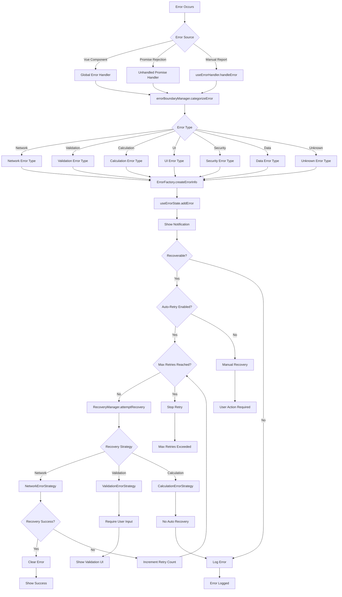
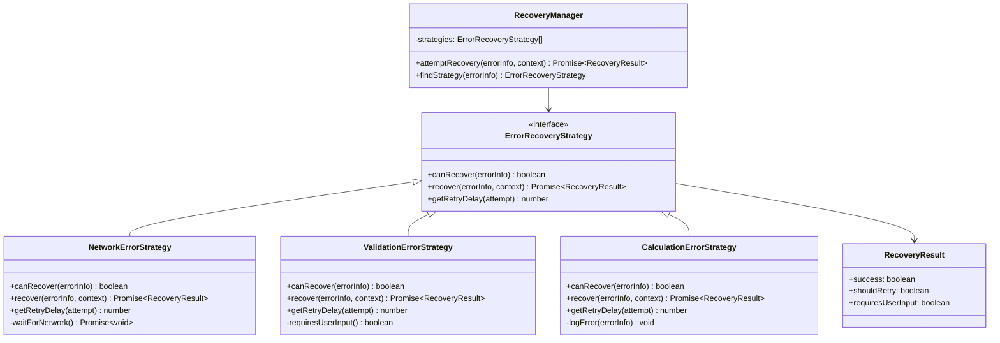
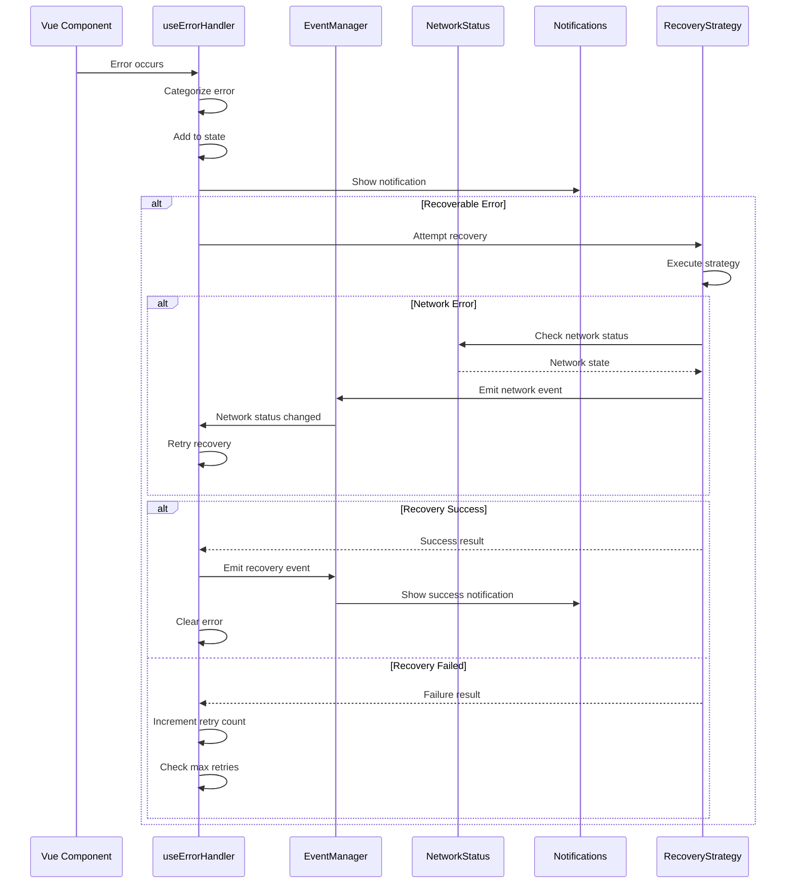

# Error Handling System Architecture Diagram

## Overview

This diagram illustrates the comprehensive error handling system in the Vue.js medical calculator application. The system follows a centralized orchestration pattern with strategy-based recovery mechanisms and event-driven communication.

## System Architecture Diagram

```
┌─────────────────────────────────────────────────────────────────────────────┐
│                        ERROR HANDLING SYSTEM                                │
│                                                                             │
│  ┌─────────────────────────────────────────────────────────────────────┐   │
│  │                    PRESENTATION LAYER                                │   │
│  │                                                                     │   │
│  │  ┌─────────────────┐     ┌─────────────────┐     ┌───────────────┐ │   │
│  │  │  Vue Components │     │  Error Boundary │     │  PrimeVue     │ │   │
│  │  │  (Medical Calc) │────▶│   Components    │────▶│   Toast       │ │   │
│  │  │                 │     │                 │     │ Notifications │ │   │
│  │  └─────────────────┘     └─────────────────┘     └───────────────┘ │   │
│  │           │                        │                       ▲       │   │
│  └───────────┼────────────────────────┼───────────────────────┼───────┘   │
│              │                        │                       │           │
│              ▼                        ▼                       │           │
│  ┌─────────────────────────────────────────────────────────────────────┐   │
│  │                    ORCHESTRATION LAYER                              │   │
│  │                                                                     │   │
│  │  ┌─────────────────────────────────────────────────────────────┐   │   │
│  │  │                   useErrorHandler                           │   │   │
│  │  │                  (Central Orchestrator)                    │   │   │
│  │  │                                                            │   │   │
│  │  │  • Error Detection & Categorization                       │   │   │
│  │  │  • Recovery Coordination                                  │   │   │
│  │  │  • Retry Logic (Max 3 attempts)                          │   │   │
│  │  │  • State Management                                       │   │   │
│  │  │  • Event Coordination                                     │   │   │
│  │  │  • Notification Dispatch                                  │   │   │
│  │  └─────────────────────────────────────────────────────────────┘   │   │
│  │                                    │                               │   │
│  └────────────────────────────────────┼───────────────────────────────┘   │
│                                       │                                   │
│                                       ▼                                   │
│  ┌─────────────────────────────────────────────────────────────────────┐   │
│  │                      SERVICE LAYER                                  │   │
│  │                                                                     │   │
│  │  ┌─────────────────┐  ┌─────────────────┐  ┌─────────────────┐    │   │
│  │  │ errorBoundary   │  │ RecoveryManager │  │   useErrorState │    │   │
│  │  │    Manager      │  │                 │  │                 │    │   │
│  │  │                 │  │  ┌───────────┐  │  │  ┌───────────┐  │    │   │
│  │  │ • Categorize    │  │  │  Network  │  │  │  │  Errors   │  │    │   │
│  │  │ • User Messages │  │  │ Strategy  │  │  │  │   Array   │  │    │   │
│  │  │ • Error Boundaries│ │  └───────────┘  │  │  └───────────┘  │    │   │
│  │  │ • Global Handler││  │  ┌───────────┐  │  │  ┌───────────┐  │    │   │
│  │  │                 │  │  │Validation │  │  │  │ Computed  │  │    │   │
│  │  │ 7 Error Types:  │  │  │ Strategy  │  │  │  │ Filtered  │  │    │   │
│  │  │ • Network       │  │  └───────────┘  │  │  │  Errors   │  │    │   │
│  │  │ • Validation    │  │  ┌───────────┐  │  │  └───────────┘  │    │   │
│  │  │ • Calculation   │  │  │Calculation│  │  │                 │    │   │
│  │  │ • UI            │  │  │ Strategy  │  │  │                 │    │   │
│  │  │ • Security      │  │  └───────────┘  │  │                 │    │   │
│  │  │ • Data          │  │                 │  │                 │    │   │
│  │  │ • Unknown       │  │                 │  │                 │    │   │
│  │  └─────────────────┘  └─────────────────┘  └─────────────────┘    │   │
│  │                                                                     │   │
│  │  ┌─────────────────┐  ┌─────────────────┐  ┌─────────────────┐    │   │
│  │  │useNotifications │  │ useNetworkStatus│  │  useEventManager│    │   │
│  │  │                 │  │                 │  │                 │    │   │
│  │  │ • Toast Messages│  │ • Online/Offline│  │ • Type-safe     │    │   │
│  │  │ • Severity Map  │  │ • Reactive State│  │   Events        │    │   │
│  │  │ • Auto-dismiss  │  │ • Navigator API │  │ • Pub/Sub       │    │   │
│  │  │ • Danish Locale │  │                 │  │ • Cleanup       │    │   │
│  │  └─────────────────┘  └─────────────────┘  └─────────────────┘    │   │
│  └─────────────────────────────────────────────────────────────────────┘   │
│                                       │                                   │
│                                       ▼                                   │
│  ┌─────────────────────────────────────────────────────────────────────┐   │
│  │                      UTILITY LAYER                                  │   │
│  │                                                                     │   │
│  │  ┌─────────────────┐               ┌─────────────────┐             │   │
│  │  │  ErrorFactory   │               │  Event Types    │             │   │
│  │  │                 │               │                 │             │   │
│  │  │ • Create Error  │               │ • network:*     │             │   │
│  │  │   Info Objects  │               │ • error:*       │             │   │
│  │  │ • Generate Keys │               │ • notification:*│             │   │
│  │  │ • Standardize   │               │                 │             │   │
│  │  │   Error Data    │               │                 │             │   │
│  │  └─────────────────┘               └─────────────────┘             │   │
│  └─────────────────────────────────────────────────────────────────────┘   │
└─────────────────────────────────────────────────────────────────────────────┘
```

## Error Flow Diagram



## Recovery Strategy Pattern



## Event System Architecture



## Key Components

- **useErrorHandler**: Central orchestrator managing the entire error lifecycle
- **errorBoundaryManager**: Categorizes errors and provides Vue.js error boundaries
- **RecoveryManager**: Coordinates recovery strategies using the Strategy pattern
- **useErrorState**: Centralized reactive state management for all errors
- **useNetworkStatus**: Monitors network connectivity for recovery decisions
- **useNotifications**: Handles user-facing error communication via PrimeVue Toast
- **useEventManager**: Type-safe event system for loose coupling between components
- **ErrorFactory**: Standardizes error object creation and key generation

## Error Type Categories

1. **Network Errors**: Connection issues, timeouts, fetch failures
2. **Validation Errors**: Form validation, input validation failures
3. **Calculation Errors**: Medical scoring calculation errors
4. **UI Errors**: Vue component rendering errors
5. **Security Errors**: Authentication and authorization failures
6. **Data Errors**: Data parsing and serialization issues
7. **Unknown Errors**: Unclassified errors requiring investigation

## Recovery Strategies

- **NetworkErrorStrategy**: Implements exponential backoff (1s → 2s → 4s → 8s → 10s max)
- **ValidationErrorStrategy**: Requires user input, no automatic recovery
- **CalculationErrorStrategy**: No automatic recovery, logs for debugging

## System Features

- **Automatic Recovery**: Intelligent retry mechanisms for recoverable errors
- **Type Safety**: Full TypeScript support with strong typing
- **Localization**: Danish error messages for medical domain
- **Event-Driven**: Loose coupling via type-safe event system
- **Vue Integration**: Proper lifecycle management and reactivity
- **Medical Domain**: Specialized handling for medical calculator errors
- **State Management**: Centralized error state with reactive updates
- **User Experience**: Appropriate notifications and recovery feedback

This architecture provides a robust, scalable, and maintainable error handling system specifically designed for medical calculator applications, with emphasis on user experience and system reliability.