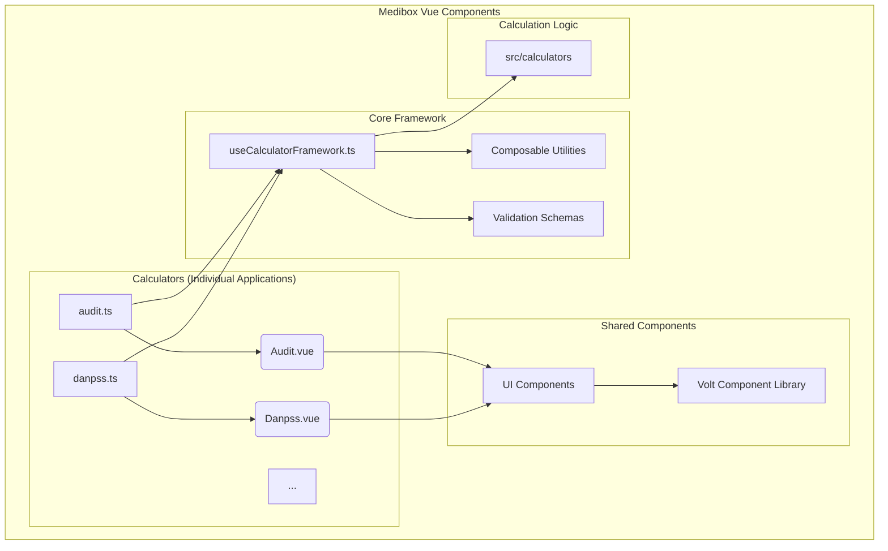

# High-Level Architecture

This diagram illustrates the overall architecture of the Medibox Vue Components library. It shows how each calculator is a self-contained application that leverages a shared framework and component library.

## Key Components

- **Calculators (Individual Applications)**: Each calculator (e.g., AUDIT, DANPSS) is a separate micro-application with its own entry point (`.ts` file) and root Vue component.
- **Core Framework**: This is the heart of the library, providing the `useCalculatorFramework` composable that manages the lifecycle and state of each calculator. It also includes other composable utilities for logging, error handling, and validation.
- **Shared Components**: A library of reusable Vue components, including both custom components and the "Volt" component library, used to build the user interface of the calculators.
- **Calculation Logic**: The business logic for each calculator is being migrated to a dedicated module within the `src/calculators` directory.

## Relationships

- **Calculators → Core Framework**: Each calculator's entry point initializes the `useCalculatorFramework` to manage its state and behavior.
- **Calculators → Shared Components**: The Vue components for each calculator are composed of smaller, reusable UI components from the shared library.
- **Core Framework → Utilities/Schemas/Logic**: The `useCalculatorFramework` relies on other composables, validation schemas, and the calculation logic to perform its functions.
- **Shared Components → Volt Library**: The custom UI components are built on top of the base components provided by the Volt library.

## Notes

- **Modular Architecture**: The project is moving towards a more modular architecture by separating the calculation logic from the core framework. This makes it easier to maintain and test individual calculators.
- **Scalability**: The use of a shared framework and component library allows for the rapid development of new calculators with a consistent look and feel.
- **Security**: The `sendDataToServer.ts` module (used by the framework) is responsible for securely submitting data to the server.
