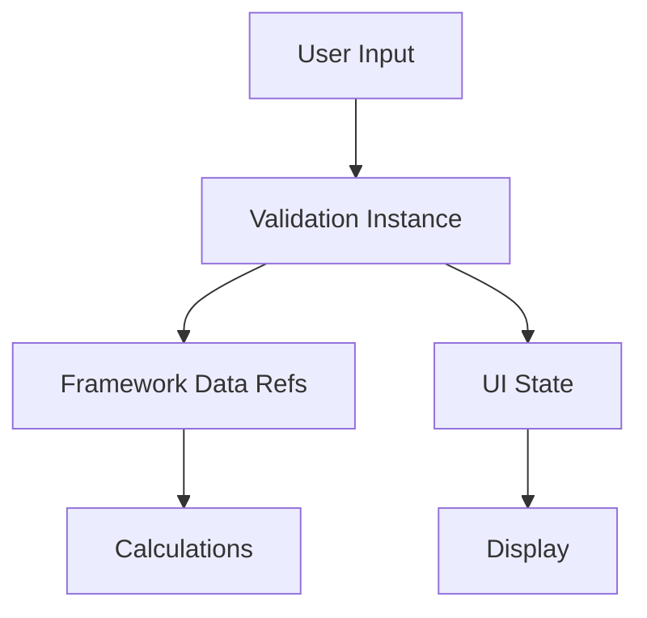

# Learning: Data Synchronization Patterns

## Issue Description

**Problem**: Multiple disconnected data sources created synchronization issues:
1. Framework had `patientData` and `calculatorData` refs
2. Validation instances had their own internal `data` refs  
3. Component had local question state (`question.answer`)
4. Manual syncing with `setFieldValue` was unreliable

This led to data being out of sync, where user inputs weren't reaching validation instances, causing validation failures.

## Root Cause

**Anti-Pattern: Multiple Sources of Truth**
```typescript
// PROBLEMATIC: Multiple disconnected data stores
const patientData = ref<Partial<PatientData>>({})           // Framework data
const calculatorData = ref<Partial<CalculatorResponses>>({}) // Framework data
const validation = useFormValidation(schema, {})            // Validation has own data
const questions = reactive([{answer: null}])                // Component data

// Manual sync attempts (unreliable)
const setFieldValue = (section, field, value) => {
  if (section === 'calculator') {
    calculatorData.value = { ...calculatorData.value, [field]: value } // ❌ Doesn't update validation
  }
}
```

## How We Mitigated

### 1. Single Source of Truth Pattern
```typescript
// AFTER: Validation instances as single source of truth
const patientValidation = useFormValidation(patientSchema)
const calculatorValidation = useFormValidation(calculatorSchema)

// Framework data points to validation data (single source)
const patientData = patientValidation.data
const calculatorData = calculatorValidation.data
```

### 2. Direct Method Delegation
```typescript
// BEFORE: Manual sync (unreliable)
const setFieldValue = (section, field, value) => {
  calculatorData.value = { ...calculatorData.value, [field]: value }
  // ❌ Validation instance never sees this change
}

// AFTER: Direct delegation to source of truth
const setFieldValue = (section, field, value) => {
  if (section === 'calculator') {
    calculatorValidation.setFieldValue(field, value) // ✅ Updates validation directly
  }
}
```

### 3. Reset Synchronization
```typescript
// BEFORE: Partial reset (leaves validation state stale)
const resetCalculator = () => {
  calculatorData.value = {}  // ❌ Doesn't reset validation state
}

// AFTER: Complete reset through source of truth
const resetCalculator = () => {
  calculatorValidation.resetValidation()  // ✅ Clears all data and state
}
```

## Key Learnings

### 1. Single Source of Truth Principle
- **One Authority**: Each piece of data should have exactly one authoritative source
- **Reference, Don't Copy**: Other components should reference the authority, not copy data
- **No Manual Sync**: If you're manually syncing data, your architecture is wrong

### 2. Data Flow Patterns
```typescript
// ✅ GOOD: Clear data flow
User Input → Validation Instance → Framework References → UI Display

// ❌ BAD: Unclear data flow with sync points
User Input → Component State → Manual Sync → Framework State → Validation Instance
```

### 3. Validation-First Architecture
```typescript
// Validation instances own the data
const validation = useFormValidation(schema)

// Framework references validation data
const frameworkData = validation.data

// Components update through validation methods
validation.setFieldValue(field, value)
```

## Best Practices Going Forward

### 1. Design Data Architecture First


### 2. Identify Single Sources of Truth
- **Form Data**: Validation instances
- **UI State**: Component reactive state
- **Calculations**: Framework computed properties
- **Navigation**: Router state

### 3. Avoid These Anti-Patterns
```typescript
// ❌ Manual data copying
someData.value = { ...otherData.value }

// ❌ Multiple sources for same data
const localData = ref({})
const globalData = ref({}) // Same conceptual data

// ❌ Update multiple places
updateLocal(data)
updateGlobal(data)
```

### 4. Use These Patterns Instead
```typescript
// ✅ Single source with references
const source = createDataSource()
const reference = source.data

// ✅ Method delegation
const updateData = (...args) => source.update(...args)

// ✅ Computed derivations
const computed = computed(() => source.data.value.derived)
```

## Implementation Checklist

Before implementing data flows:

- [ ] Map out all data sources and their relationships
- [ ] Identify single source of truth for each data type
- [ ] Design update methods that work through sources of truth
- [ ] Ensure reset operations clear all related state
- [ ] Verify data flows are unidirectional where possible
- [ ] Test data synchronization edge cases

## Common Synchronization Pitfalls

1. **Stale Closures**: Copying data at initialization time
2. **Partial Updates**: Updating some but not all related state
3. **Race Conditions**: Multiple async updates to same data
4. **Forgotten Dependencies**: Missing reactive dependencies in computed/watch

## Prevention Strategy

- Always ask: "What is the single source of truth for this data?"
- Use reactive references, not reactive copies
- Design update methods that go through the source of truth
- Test data flow with complex scenarios (reset, validation, etc.)
- Document data architecture decisions