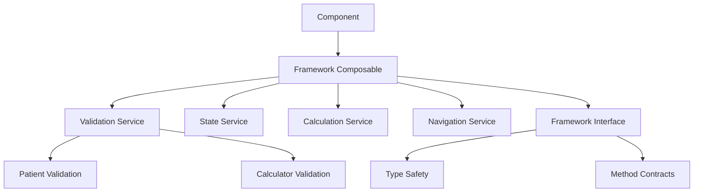

# Learning: Framework Method Integration

## Issue Description

**Problem**: The audit calculator threw "framework.initializeSteps is not a function" and "framework.setFieldValue is not a function" errors because required methods were missing from the framework composable.

This occurred when the component tried to call methods that weren't implemented in the `useCalculatorFramework` composable, breaking the application flow.

## Root Cause

**Missing Interface Implementation**: The framework composable was missing methods that components expected to be available:

```typescript
// MISSING: Components expected these methods but they weren't implemented
framework.initializeSteps(steps)
framework.setFieldValue('patient', 'name', value)
```

**Interface vs Implementation Gap**: The TypeScript interface defined methods that weren't actually implemented in the composable.

## How We Mitigated

### 1. Added Missing Method Implementations

```typescript
// ADDED: setFieldValue method for data updates
const setFieldValue = (section: 'patient' | 'calculator', field: string, value: any) => {
  if (section === 'patient') {
    patientValidation.setFieldValue(field, value)
  } else if (section === 'calculator') {
    calculatorValidation.setFieldValue(field, value)
  }
}

// ADDED: initializeSteps method for step management  
const initializeSteps = (steps: CalculatorStep[]) => {
  state.value.totalSteps = steps.length
  // Additional step initialization logic can be added here
}
```

### 2. Proper Method Delegation

```typescript
// Methods delegate to validation instances (single source of truth)
const setFieldValue = (section, field, value) => {
  if (section === 'patient') {
    patientValidation.setFieldValue(field, value) // ✅ Uses validation instance
  } else if (section === 'calculator') {
    calculatorValidation.setFieldValue(field, value) // ✅ Uses validation instance
  }
}
```

### 3. Interface-Implementation Alignment

```typescript
// BEFORE: Interface promised methods that didn't exist
export interface CalculatorFrameworkReturn {
  setFieldValue: (section: 'patient' | 'calculator', field: string, value: any) => void
  initializeSteps: (steps: CalculatorStep[]) => void
  // ... other methods
}

// AFTER: All interface methods are actually implemented
return {
  setFieldValue,      // ✅ Now implemented
  initializeSteps,    // ✅ Now implemented
  // ... all other methods from interface
}
```

## Key Learnings

### 1. Interface-Implementation Contract
- **Always Implement Promised Methods**: If an interface declares a method, it must be implemented
- **TypeScript Doesn't Catch Runtime Calls**: Interface compliance doesn't guarantee method availability at runtime
- **Test Method Calls**: Verify that all interface methods can actually be called

### 2. Dependency Injection Patterns

```typescript
// ✅ GOOD: Framework methods delegate to appropriate services
const setFieldValue = (section, field, value) => {
  if (section === 'patient') {
    patientValidation.setFieldValue(field, value)    // Patient data service
  } else if (section === 'calculator') {
    calculatorValidation.setFieldValue(field, value) // Calculator data service
  }
}

// ❌ BAD: Framework methods contain business logic
const setFieldValue = (section, field, value) => {
  if (section === 'patient') {
    patientData.value = { ...patientData.value, [field]: value } // Direct manipulation
  }
}
```

### 3. Framework API Design

```typescript
// Framework should provide consistent, predictable methods
interface CalculatorFrameworkReturn {
  // Data access
  patientData: Ref<PatientData>
  calculatorData: Ref<CalculatorData>
  
  // Data manipulation
  setFieldValue: (section, field, value) => void
  resetCalculator: () => void
  
  // Navigation
  initializeSteps: (steps) => void
  nextStep: () => void
  
  // Actions
  submitCalculation: () => Promise<boolean>
}
```

## Best Practices Going Forward

### 1. Implementation-Driven Development

```typescript
// Step 1: Define the interface based on component needs
interface FrameworkAPI {
  methodNeeded: () => void
}

// Step 2: Implement ALL methods in the composable
export function useFramework(): FrameworkAPI {
  const methodNeeded = () => {
    // Implementation here
  }
  
  return {
    methodNeeded // ✅ All interface methods implemented
  }
}

// Step 3: Verify implementation matches interface
const framework: FrameworkAPI = useFramework() // ✅ Type-safe
```

### 2. Method Delegation Strategy

```typescript
// Framework methods should delegate to appropriate services
const framework = {
  // Data methods → validation services
  setFieldValue: (section, field, value) => validationService.set(section, field, value),
  
  // Navigation methods → state service  
  nextStep: () => stateService.incrementStep(),
  
  // Calculation methods → calculation service
  calculateScore: (data) => calculationService.calculate(data)
}
```

### 3. Integration Testing

```typescript
// Test that all interface methods can be called
describe('Framework Integration', () => {
  it('should implement all interface methods', () => {
    const framework = useCalculatorFramework(config)
    
    // Verify methods exist
    expect(framework.setFieldValue).toBeInstanceOf(Function)
    expect(framework.initializeSteps).toBeInstanceOf(Function)
    
    // Verify methods can be called
    expect(() => framework.setFieldValue('patient', 'name', 'test')).not.toThrow()
    expect(() => framework.initializeSteps([])).not.toThrow()
  })
})
```

## Prevention Strategy

### 1. Interface-First Development
- Define interfaces based on actual component usage
- Implement all interface methods before using the composable
- Use TypeScript strict mode to catch missing implementations

### 2. Runtime Verification
```typescript
// Add runtime checks for critical methods
const verifyFrameworkMethods = (framework: CalculatorFrameworkReturn) => {
  const requiredMethods = ['setFieldValue', 'initializeSteps', 'submitCalculation']
  
  requiredMethods.forEach(method => {
    if (typeof framework[method] !== 'function') {
      throw new Error(`Framework missing required method: ${method}`)
    }
  })
}
```

### 3. Component-Framework Contract Testing
```typescript
// Test components with real framework instances
describe('AuditScore Component', () => {
  it('should work with framework methods', () => {
    const framework = useCalculatorFramework(config)
    
    // Test that component can call framework methods
    framework.setFieldValue('patient', 'name', 'Test Patient')
    framework.initializeSteps([{ id: 'step1', title: 'Step 1', order: 1 }])
    
    // Verify framework state updated correctly
    expect(framework.patientData.value.name).toBe('Test Patient')
    expect(framework.state.value.totalSteps).toBe(1)
  })
})
```

## Common Integration Pitfalls

1. **Interface Promises More Than Implementation Delivers**
   - Interface declares methods that don't exist
   - Runtime errors when methods are called

2. **Method Signature Mismatches**
   - Interface and implementation have different parameters
   - Type errors or runtime failures

3. **Missing Error Handling**
   - Methods don't handle edge cases
   - Unhandled exceptions bubble up to components

4. **Inconsistent Method Behavior**
   - Same method behaves differently in different contexts
   - Unpredictable component behavior

## Implementation Checklist

Before finalizing framework composables:

- [ ] Verify all interface methods are implemented
- [ ] Test method calls with realistic parameters
- [ ] Add error handling for edge cases
- [ ] Document method behavior and side effects
- [ ] Test integration with actual components
- [ ] Add runtime validation for critical methods
- [ ] Create comprehensive integration tests

## Framework Integration Architecture



The framework acts as a coordination layer that:
1. Provides a consistent API to components
2. Delegates to appropriate services
3. Maintains type safety through interfaces
4. Ensures all promised methods are actually available