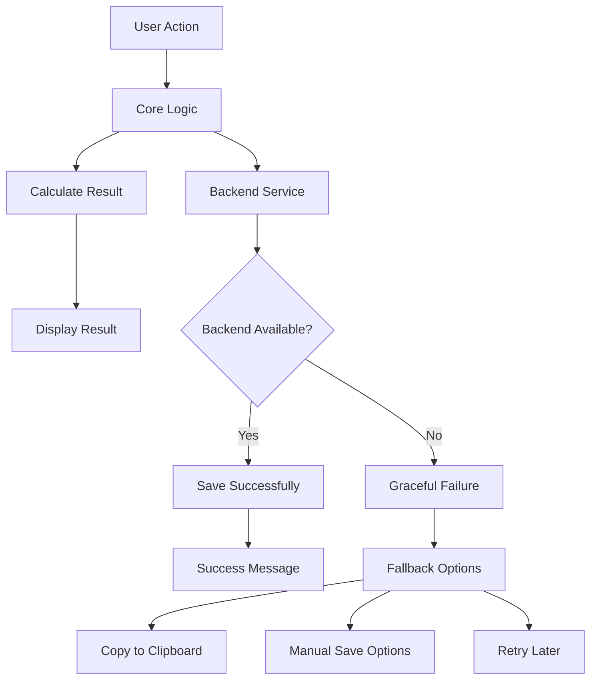

# Learning: Development vs Production Environment Differences

## Issue Description

**Problem**: The audit calculator worked correctly in development but showed different behavior when backend services weren't available or when validation/submission logic differed between environments.

Key differences included:
1. Backend submission success/failure affecting UI result display
2. Validation behavior differences between local development and deployed environments
3. Different error handling requirements for development vs production

## Root Cause

**Coupled Success States**: The original implementation tied calculation success to submission success, meaning:
- In development: Backend might not be running → submission fails → results don't show
- In production: Backend errors → submission fails → user sees no results despite successful calculation

**Environment-Dependent Logic**: Code behavior changed based on whether backend services were available.

## How We Mitigated

### 1. Separated Calculation from Submission

```typescript
// BEFORE: Calculation success tied to submission success
const submitCalculation = async (): Promise<boolean> => {
  const calculationResult = calculateScore(data)
  const submissionResult = await submitToBackend(data, calculationResult)
  
  if (!submissionResult) {
    throw new Error('Submission failed') // ❌ Calculation result lost
  }
  
  result.value = calculationResult
  return true
}

// AFTER: Calculation success independent of submission
const submitCalculation = async (): Promise<boolean> => {
  // Calculate result first
  const calculationResult = calculateScore(calculatorData.value as CalculatorResponses)
  result.value = calculationResult
  
  // Mark as complete since calculation succeeded
  state.value.isComplete = true
  state.value.completionTime = new Date()

  // Submit using the service (optional - don't fail if submission fails)
  try {
    const success = await submissionService.submitCalculation(...)
    return success
  } catch (submissionError) {
    // Log submission error but don't fail the calculation
    console.warn('Submission failed but calculation completed:', submissionError)
    return true // ✅ Return true since calculation succeeded
  }
}
```

### 2. Environment-Agnostic UI Logic

```typescript
// BEFORE: UI depends on submission success
<div v-if="submissionSuccessful && calculationComplete" class="results">
  <!-- Results only show if backend submission worked -->
</div>

// AFTER: UI depends only on calculation success
<div v-if="framework.state.isComplete && framework.result.value" class="results">
  <!-- Results show as soon as calculation is complete -->
</div>
```

### 3. Graceful Backend Degradation

```typescript
// Development-friendly backend handling
try {
  const success = await submissionService.submitCalculation(...)
  if (success) {
    showSuccess('Beregning gemt', 'Resultatet er gemt til patientjournalen')
  }
} catch (submissionError) {
  // Don't fail the entire operation
  if (isDevelopment()) {
    console.warn('Backend not available in development:', submissionError)
  } else {
    logError('Submission failed in production', submissionError)
    showWarning('Beregning fuldført', 'Resultatet kunne ikke gemmes automatisk')
  }
}
```

## Key Learnings

### 1. Separate Core Logic from External Dependencies

```typescript
// ✅ GOOD: Core business logic independent of external services
const calculateResult = (data) => {
  // Pure calculation - no external dependencies
  return computeScore(data)
}

const saveResult = async (result) => {
  // Separate concern - can fail without affecting calculation
  try {
    await backend.save(result)
  } catch (error) {
    // Handle gracefully
  }
}

// ❌ BAD: Core logic coupled to external services
const processData = async (data) => {
  const result = computeScore(data)
  await backend.save(result) // If this fails, user loses result
  return result
}
```

### 2. Environment-Aware Error Handling

```typescript
const handleEnvironmentError = (error: Error, context: string) => {
  if (process.env.NODE_ENV === 'development') {
    // Development: More verbose, less critical
    console.warn(`${context} (development):`, error.message)
    showToast('info', 'Backend not available in development mode')
  } else {
    // Production: Log properly, user-friendly messages
    logError(context, error)
    showToast('error', 'En fejl opstod. Prøv igen eller kontakt support.')
  }
}
```

### 3. Progressive Enhancement Pattern

```typescript
// Base functionality works without backend
const framework = {
  calculateScore: (data) => {
    // ✅ Always works - no external dependencies
    return computeLocalScore(data)
  },
  
  saveToBackend: async (data) => {
    // ✅ Enhancement - graceful failure
    try {
      return await api.save(data)
    } catch (error) {
      // Fails gracefully - doesn't break core functionality
      return false
    }
  }
}
```

## Best Practices Going Forward

### 1. Design for Backend Unavailability

```typescript
// Always assume backend might be unavailable
const submitCalculation = async () => {
  // Step 1: Core functionality (must work)
  const result = calculateScore(data)
  displayResult(result)
  
  // Step 2: Enhancement (can fail)
  try {
    await saveToBackend(result)
    showSuccess('Saved successfully')
  } catch (error) {
    showWarning('Calculated but not saved - you can copy the result manually')
  }
}
```

### 2. Environment Configuration

```typescript
// Environment-specific configuration
const config = {
  development: {
    submitToBackend: false,
    showBackendErrors: true,
    logLevel: 'debug'
  },
  production: {
    submitToBackend: true,
    showBackendErrors: false,
    logLevel: 'error'
  }
}

const currentConfig = config[process.env.NODE_ENV || 'development']
```

### 3. Fallback UI States

```vue
<template>
  <!-- Always show calculation results -->
  <div v-if="hasResult" class="results">
    <h2>{{ result.score }} - {{ result.interpretation }}</h2>
    
    <!-- Backend-dependent features with fallbacks -->
    <div v-if="isOnline && backendAvailable">
      <button @click="saveToJournal">Gem til journal</button>
    </div>
    <div v-else>
      <CopyToClipboard :text="result" />
      <p class="text-sm">Kopier resultatet manuelt da auto-gem ikke er tilgængeligt</p>
    </div>
  </div>
</template>
```

## Environment Testing Strategy

### 1. Development Environment Tests
```typescript
describe('Development Environment', () => {
  beforeEach(() => {
    // Simulate backend unavailability
    mockBackend.disable()
  })
  
  it('should calculate results without backend', async () => {
    const result = await framework.submitCalculation()
    expect(framework.result.value).toBeTruthy()
    expect(framework.state.value.isComplete).toBe(true)
  })
  
  it('should show helpful development messages', () => {
    // Test development-specific messaging
  })
})
```

### 2. Production Simulation Tests
```typescript
describe('Production Environment', () => {
  it('should handle backend failures gracefully', async () => {
    mockBackend.enable()
    mockBackend.failAll()
    
    const result = await framework.submitCalculation()
    expect(framework.result.value).toBeTruthy() // Calculation still works
    expect(consoleWarnSpy).toHaveBeenCalledWith(expect.stringContaining('Submission failed'))
  })
})
```

### 3. Cross-Environment Consistency Tests
```typescript
describe('Cross-Environment', () => {
  it('should produce same calculation results regardless of environment', () => {
    const testData = { question1: 2, question2: 3 }
    
    const devResult = calculateInEnvironment('development', testData)
    const prodResult = calculateInEnvironment('production', testData)
    
    expect(devResult.score).toBe(prodResult.score)
    expect(devResult.interpretation).toBe(prodResult.interpretation)
  })
})
```

## Prevention Strategy

### 1. Environment-Agnostic Core Logic
- Keep calculation logic pure and dependency-free
- Separate UI logic from backend logic
- Use dependency injection for external services

### 2. Robust Error Boundaries
```typescript
// Wrap external dependencies in error boundaries
const withErrorBoundary = async <T>(
  operation: () => Promise<T>,
  fallback: T,
  context: string
): Promise<T> => {
  try {
    return await operation()
  } catch (error) {
    handleEnvironmentError(error, context)
    return fallback
  }
}

// Usage
const saveResult = await withErrorBoundary(
  () => backend.save(result),
  false,
  'result-submission'
)
```

### 3. Feature Flags for Environment Differences
```typescript
const features = {
  backendSubmission: process.env.NODE_ENV === 'production',
  debugLogging: process.env.NODE_ENV === 'development',
  errorReporting: process.env.NODE_ENV === 'production'
}

if (features.backendSubmission) {
  await submitToBackend(result)
}
```

## Common Environment Pitfalls

1. **Assuming Backend Availability**
   - Code breaks when backend is down
   - No fallback for offline scenarios

2. **Environment-Specific Logic Buried in Components**
   - Hard to test different environments
   - Inconsistent behavior across deployments

3. **Success/Failure Coupling**
   - One failure breaks entire workflow
   - User loses work due to network issues

4. **Missing Environment Testing**
   - Code works in development but fails in production
   - Different validation behavior across environments

## Implementation Checklist

For environment-resilient applications:

- [ ] Core functionality works without external dependencies
- [ ] Backend failures don't break user workflows
- [ ] Environment-specific configuration is centralized
- [ ] Error handling differs appropriately by environment
- [ ] UI provides fallbacks for missing backend features
- [ ] Cross-environment testing covers key scenarios
- [ ] Feature flags control environment-specific behavior
- [ ] Users can complete tasks even when backend is unavailable

## Environment Resilience Architecture



This architecture ensures:
1. Core functionality always works
2. Backend integration is optional enhancement
3. Users always have fallback options
4. System degrades gracefully under failure conditions