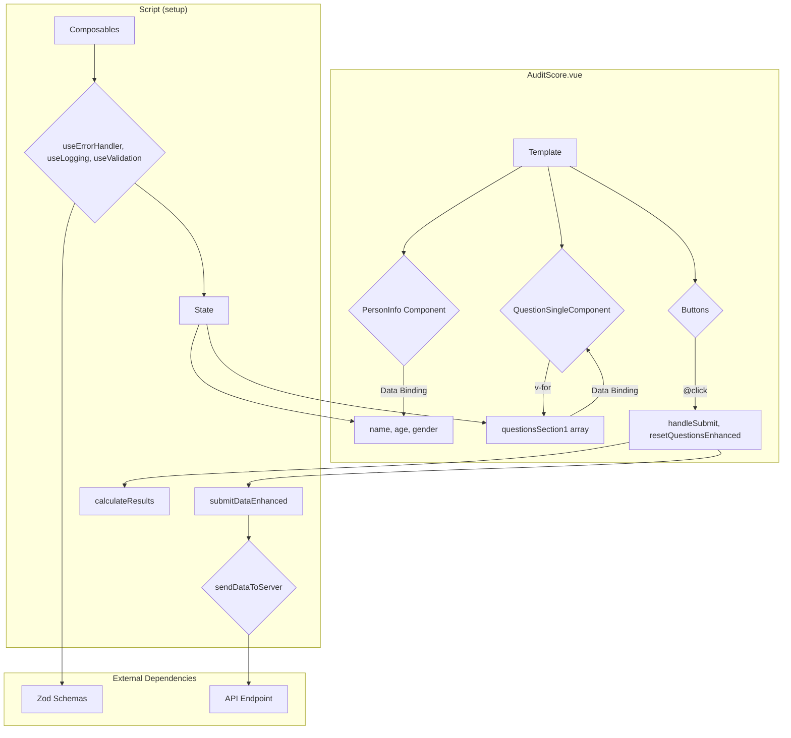

# System Breakdown: Submission, Validation, and Implementation

This document provides a detailed breakdown of three core aspects of the Medibox Vue Components library: the data submission flow, the validation layer, and a concrete implementation example.

### 1. Data Submission Flow (`sendDataToServer`)

This flow is critical for security. It ensures that patient data is encrypted before being transmitted. The process involves fetching a public key, encrypting the payload, and then sending the encrypted data, with a retry mechanism for reliability.

```mermaid
sequenceDiagram
    participant C as Calculator Framework
    participant S as sendDataToServer
    participant PK as Public Key Endpoint
    participant API as API Endpoint

    C->>S: submitCalculation(data)
    S->>PK: GET /public-key
    activate PK
    PK-->>S: Returns Public Key
    deactivate PK

    alt Public Key Fetch Fails
        S-->>C: Throw PublicKeyError
    end

    S->>S: Generate random AES key
    S->>S: Encrypt (data) with AES key
    S->>S: Encrypt (AES key) with Public Key

    alt Encryption Fails
        S-->>C: Throw EncryptionError
    end

    loop Retry Loop (up to 3 times)
        S->>API: POST /submit (encrypted payload)
        activate API

        alt Request Succeeds (200 OK)
            API-->>S: Success Response
            deactivate API
            S-->>C: Return Success
        else Request Fails (e.g., 500, Timeout)
            API-->>S: Error Response
            deactivate API
            S->>S: Wait (exponential backoff)
        end
    end

    S-->>C: Throw NetworkError (after all retries fail)
```

**Key Steps:**

1.  **Fetch Public Key**: Before sending any sensitive data, the client fetches a public key from a dedicated endpoint. This is a crucial first step for the asymmetric encryption process.
2.  **Hybrid Encryption**:
    *   A **new, random AES symmetric key** is generated on the client for each submission.
    *   The actual `payload` (the user's calculator data) is encrypted using this one-time AES key.
    *   The AES key itself is then encrypted using the fetched **public key** (RSA encryption).
    *   This hybrid approach is efficient and secure. AES is fast for encrypting large data, while RSA is used to securely transmit the key.
3.  **Transmit**: The client sends the AES-encrypted payload, the RSA-encrypted AES key, and the initialization vector (IV) to the main API endpoint.
4.  **Retry Logic**: If the network request fails (e.g., due to a server error or timeout), the `sendDataToServer` function will automatically retry the request up to 3 times with an exponential backoff delay to avoid overwhelming the server.

### 2. Validation Layer (`useValidation` & Zod Schemas)

The application uses `zod` for schema definition and validation, which provides a robust way to ensure data integrity before it's processed or sent to the server. This is managed by the `useValidation` and `useFormValidation` composables.

```mermaid
graph TD
    subgraph "Validation Flow"
        A[User Input] --> B(setFieldValue);
        B --> C{useValidation};
        C --> D[Debounced Validation];
        D --> E{Zod Schema};
        E --> F[schema.parse(data)];
        F -- Success --> G[isValid = true];
        F -- Failure --> H[Errors array populated];
    end

    subgraph "Schema Definitions (src/schemas/calculators.ts)"
        I[AuditSchema];
        J[DanpssSchema];
        K[...other schemas];
        L[getCalculatorSchema(type)];
    end

    C --> L;
```

**Key Concepts:**

1.  **`useValidation` Composable**: This is a generic, reusable composable that takes a Zod schema as input. It manages the validation state (`isValid`, `errors`, `touched` fields, etc.) and provides methods to trigger validation (`validateField`, `validateAll`).
2.  **Zod Schemas**: In `src/schemas/calculators.ts`, each calculator has a corresponding Zod schema (e.g., `AuditSchema`, `EpdsSchema`). These schemas define the expected data types, value ranges (min/max), and formats for every single field.
3.  **Dynamic Schema Loading**: The `useCalculatorFramework` dynamically gets the correct schema for the current calculator by calling `getCalculatorSchema(config.type)`. This is a key part of its generic nature.
4.  **Real-time Feedback**: The framework is configured to validate fields on input (with a 300ms debounce). This provides immediate feedback to the user if they enter invalid data, improving the user experience.
5.  **Final Validation**: Before submission, `validateAll()` is called to perform a final, comprehensive check on the entire data object, ensuring its integrity before the calculation and submission steps.

### 3. Calculator Implementation Example (`AuditScore.vue`)

This section shows how a specific calculator, `AuditScore.vue`, uses the framework. This ties everything together.



**How it Works:**

1.  **Component Structure**:
    *   The template is built using reusable components like `SurfaceCard`, `PersonInfo`, and `QuestionSingleComponent`.
    *   `v-for` is used to render the list of questions from the `questionsSection1` reactive array.
    *   Data binding (`v-model` or equivalent) links the UI elements to the component's state (e.g., `name`, `age`, `question.answer`).

2.  **No `useCalculatorFramework`**:
    *   Interestingly, this component *does not* use the `useCalculatorFramework`. It implements all the logic for state management, validation, and submission itself. This suggests it might be an older component, created before the framework was developed, or a component with unique requirements that didn't fit the framework's model.
    *   It manually calls `useErrorHandler`, `useLogging`, and `useValidation`, demonstrating a more manual setup.

3.  **State Management**:
    *   It uses `ref` for all its state, including patient info (`name`, `age`), the list of questions, the results, and UI state (`isSubmitting`).

4.  **Execution Flow**:
    *   When the user clicks "Beregn" (Calculate), the `handleSubmit` method is called.
    *   It first performs its own validation (`validateQuestionsEnhanced`).
    *   If valid, it calls `calculateResults` to compute the `totalScore`.
    *   Finally, it calls `submitDataEnhanced`, which formats the payload and calls the `sendDataToServer` utility.

5.  **Testing**:
    *   The `AuditScore.test.ts` file shows a comprehensive suite of unit tests.
    *   It heavily mocks the composables (`useLogging`, `useValidation`) and external services (`sendDataToServer`) to isolate the component's logic for testing. This is a best practice that allows for fast and reliable tests focused solely on the component's behavior.
